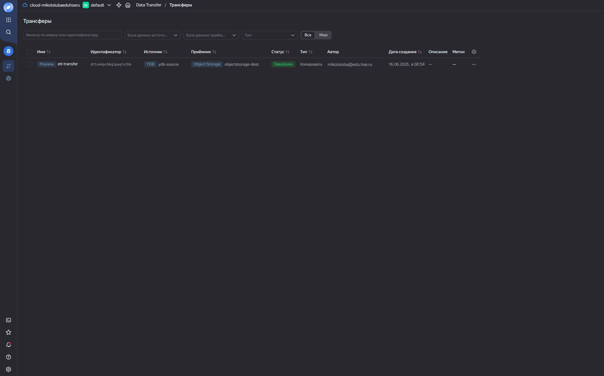
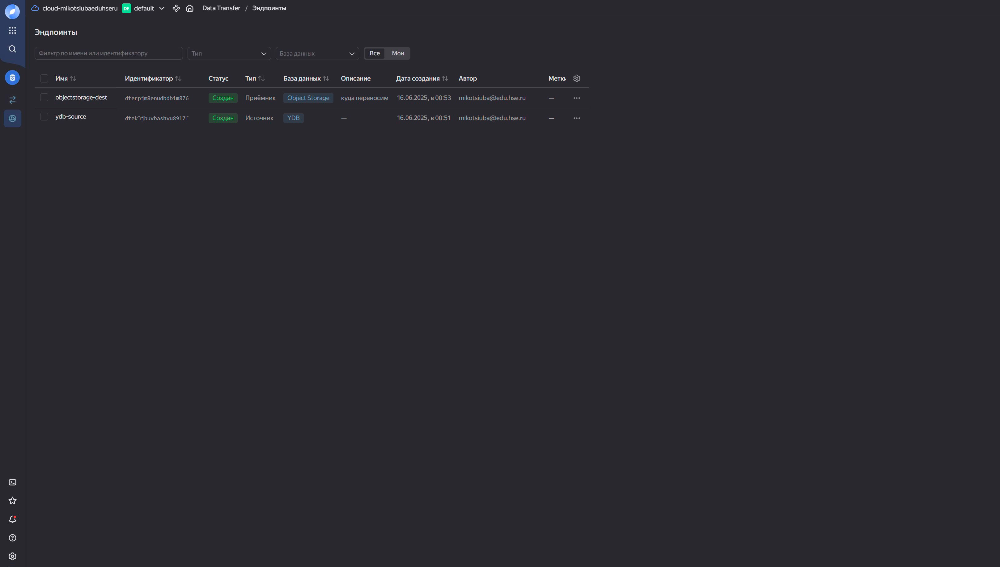

# Итоговое задание ETL

### Этапы проекта:

- Установка и настройка инструментов командной строки: Yandex CLI и YDB CLI, включая настройку авторизации.
- Создание базы данных в Yandex Database (YDB) и организация переноса данных в Yandex Object Storage (S3).
- Развертывание и конфигурация Apache Airflow, интеграция с Yandex MetaDataHub и Yandex Data Processing.
- Разработка PySpark-скриптов и создание DAG для автоматизации процессов обработки данных.
- Работа с Apache Kafka®: настройка взаимодействия топиков Kafka и обработка данных через PySpark-задания в Yandex Data Processing (в процессе доработки).
- Визуализация данных с использованием Yandex DataLens (в процессе реализации).

### Задание 1. Работа с Yandex DataTransfer

Создал табличку для данных с [kaggle](https://www.kaggle.com/datasets)
  

    
<i>DDL скрипт</i>

    
    CREATE TABLE transactions_v2 (
          msno Utf8,
          payment_method_id Int32,
          payment_plan_days Int32,
          plan_list_price Int32,
          actual_amount_paid Int32,
          is_auto_renew Int8,
          transaction_date Utf8,
          membership_expire_date Utf8,
          is_cancel Int8,
          PRIMARY KEY (msno)
      );

  
 
- В созданную таблицу с помощью CLI загружен датасет transaction_v2
  

    
<i>bash скрипт</i>

  
    ### bash-скрипт загрузки датасета
    
    ydb  `
    --endpoint grpcs://ydb.serverless.yandexcloud.net:2135 `
    --database /ru-central1/[эндпоинт]/['эндпоинт] `
    --sa-key-file key.json `
    import file csv `
    --path transactions_v2 `
    --delimiter "," `
    --skip-rows 1 `
    --null-value "" `
    --verbose `
    transactions_v2.csv
  
 
- Создан трансфер данных с источником в YDB и приемником в Object Storage
  `s3a://etl-data-transform/transactions_v2.parquet`
  
#### Скриншоты

